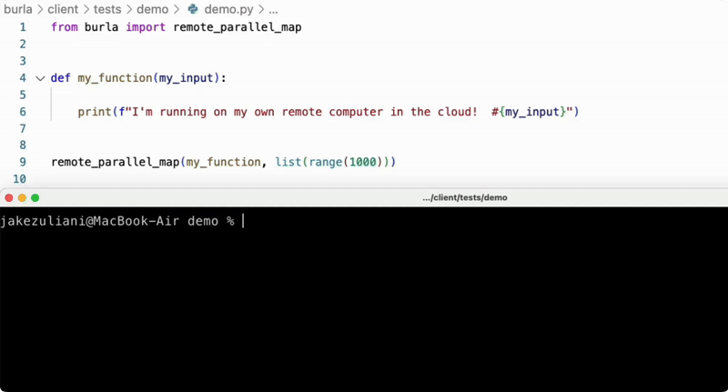

---
layout:
  width: default
  title:
    visible: false
  description:
    visible: false
  tableOfContents:
    visible: true
  outline:
    visible: false
  pagination:
    visible: false
  metadata:
    visible: false
---

# Enable any

### Enable anyone to process terabytes of data in minutes.

Burla makes it trivial to run Python functions on thousands of computers in the cloud.\
It's a Python package that only has **one function**:

<figure><figcaption></figcaption></figure>

<p align="center">This realtime example runs <code>my_function</code> on 1,000 separate computers in one second!</p>

### Burla is simple, flexible, and scalable:

* **Scalable:** [See our demo](examples/process-2.4tb-of-parquet-files-in-76s.md) where we process 2.4TB of parquet files in 76s using 10,000 CPUs.
* **Flexible:** Runs any Python function, inside any Docker container, on any hardware.
* **Easy to learn:** Burla is just one function, with two required arguments.

In addition Burla is open-source, and can be deployed in your cloud using just [one command](get-started.md#quickstart-self-hosted).\
The included web platform makes it easy to monitor long-running workloads or data-pipelines.

<figure><figcaption></figcaption></figure>

### **How it works:**

Burla only has one function: `remote_parallel_map`  \
When called, it runs the given function, on every input in the given list, each on a separate computer.

```python
from burla import remote_parallel_map

my_inputs = [1, 2, 3]

def my_function(my_input):
    print("I'm running on my own separate computer in the cloud!")
    return my_input
    
return_values = remote_parallel_map(my_function, my_inputs)
```

Running code in the cloud with Burla feels the same as coding locally:

* Anything you print appears in your local terminal.
* Exceptions thrown in your code are thrown on your local machine.
* Responses are quick, you run a million function calls in a couple seconds!

### Features:


{% column width="50%" %}
#### 📦 Automatic Package Sync

Burla clusters automatically (and very quickly) install any missing python packages into all containers in the cluster.

#### 🐋 Custom Containers

Easily run code in any Docker container. Public or private, just paste an image URI in the settings, then hit start!


{% column width="50%" %}
#### 📂 Network Filesystem

Need to get big data into/out of the cluster? Burla automatically mounts a cloud storage bucket to `./shared` in every container.

#### ⚙️ Variable Hardware Per-Function

The `func_cpu` and `func_ram` args make it possible to assign more hardware to some functions, and less to others, unlocking new ways to simplify pipelines and architecture.



### Build massive pipelines with plain Python:

Create pipelines that fan in/out over thousands of machines, then aggregate data in one big machine.\
The network filesystem mounted at \`./shared\` makes it easy to pass big data between steps.

```python
from burla import remote_parallel_map

# Run `process_file` on many small machines
results = remote_parallel_map(process_file, files)

# Combine results on one big machine
result = remote_parallel_map(combine_results, [results], func_ram=256)
```

### Demo:



### Try it out today:

There are two ways to host Burla:

1. **In your cloud.**\
   Burla is open-source, and can be deployed with one command (currently Google-Cloud only).\
   [Click here](https://docs.burla.dev/get-started#quickstart-self-hosted) to get started with self-hosted Burla.
2. **In our cloud.**\
   First $1,000 in compute spend is free, try it now 👇



### Get a free proof of concept:  We build first. You decide later.

[Schedule a call](https://cal.com/jakez/burla?user=jakez\&duration=30) and we'll build a functional proof of concept specific to your problem.\
We've delivered plug and play, production-ready systems for companies working on:

* DNA analysis / genomic pipelining
* Medical image processing for ML
* Video game replay analysis
* Reinforcement learning simulations
* Industrial CT-scan analysis




***

Questions?\
[Schedule a call](http://cal.com/jakez/burla), or email **jake@burla.dev**. We're always happy to talk.
