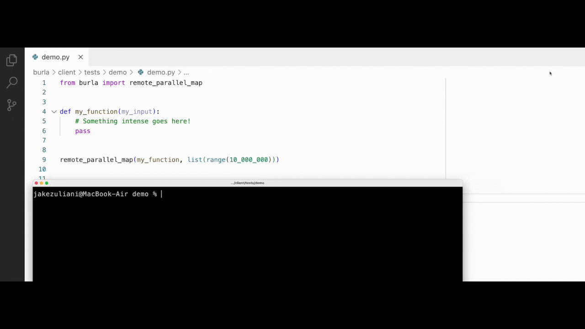
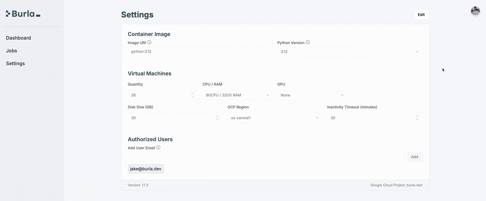

# Welcome

### Run any Python function on 1000 computers in 1 second.

Iterate at the speed of thought.\
Not at the speed your lambda function, ETL-pipeline, or Kubernetes service takes to redeploy.\
Burla is open-source, runs in your cloud, and can be installed with just two commands.

<figure><figcaption></figcaption></figure>

#### One Function, Endless Possibility:

<table data-view="cards"><thead><tr><th align="center"></th><th data-hidden data-card-cover data-type="files"></th><th data-hidden data-card-target data-type="content-ref"></th></tr></thead><tbody><tr><td align="center">Save Big on Batch AI Inference</td><td><a href=".gitbook/assets/Screenshot 2025-07-13 at 5.42.56 PM.png">Screenshot 2025-07-13 at 5.42.56 PM.png</a></td><td><a href="use-cases/">use-cases</a></td></tr><tr><td align="center">Orchestrate Data Pipelines</td><td><a href=".gitbook/assets/Screenshot 2025-07-16 at 11.41.14 AM.png">Screenshot 2025-07-16 at 11.41.14 AM.png</a></td><td></td></tr><tr><td align="center">Scale Computational Bio</td><td><a href=".gitbook/assets/Screenshot 2025-07-13 at 5.42.46 PM.png">Screenshot 2025-07-13 at 5.42.46 PM.png</a></td><td><a href="use-cases/">use-cases</a></td></tr><tr><td align="center">Develop in Remote Environments</td><td><a href=".gitbook/assets/Screenshot 2025-07-16 at 12.27.14 PM.png">Screenshot 2025-07-16 at 12.27.14 PM.png</a></td><td></td></tr><tr><td align="center">Prepare Terabytes of Data</td><td><a href=".gitbook/assets/Screenshot 2025-07-13 at 5.40.15 PM.png">Screenshot 2025-07-13 at 5.40.15 PM.png</a></td><td><a href="use-cases/">use-cases</a></td></tr><tr><td align="center">Simplify AI Agent Development</td><td><a href=".gitbook/assets/Screenshot 2025-07-18 at 1.06.55 AM.png">Screenshot 2025-07-18 at 1.06.55 AM.png</a></td><td></td></tr></tbody></table>

#### How It Works:

Burla is a platform for orchestrating parallel Python in the cloud.\
It only has one function:

```python
from burla import remote_parallel_map

def my_function(my_input):
    print("I'm running on my own separate computer in the cloud!")
    return my_input
    
return_values = remote_parallel_map(my_function, [1, 2, 3])
```

With Burla, running code in the cloud feels the same as coding locally:

* Anything you print appears your local terminal.
* Exceptions thrown in your code are thrown on your local machine.
* Responses are pretty quick, you can call a million simple functions in a couple seconds.

#### Attach Big Hardware to Functions That Need It:

Zero config files, just simple arguments like `func_cpu` & `func_ram`.

```python
from xgboost import XGBClassifier

def train_model(hyper_parameters):
    model = XGBClassifier(n_jobs=64, **hyper_parameters)
    model.fit(training_inputs, training_targets)
    
remote_parallel_map(train_model, parameter_grid, func_cpu=64, func_ram=256)
```

#### A Fast, Scalable Task Queue:

Queue up 10 Million function calls, and run them with thousands of containers.\
Our custom distributed task queue is incredibly fast, keeping hardware utilization high.

<figure><figcaption><p>This demo is in realtime!</p></figcaption></figure>

#### Simple, Flexible Pipelines:

Nest `remote_parallel_map` calls to build simple, massively parallel pipelines.\
Use `background=True` to fire and forget code, then monitor progress from the dashboard.

```python
from burla import remote_parallel_map

def process_record(record):
    return result

def process_file(file):
    results = remote_parallel_map(process_record, split_into_records(file))
    upload_results(results)

def process_files(files):
    remote_parallel_map(process_file, files, func_ram=16)
    

remote_parallel_map(process_files, [files], background=True)
```

#### Run Code in any Docker Image, on any Hardware:

Public or private, just paste a link to your image and hit start.\
Scale to 10,000 CPU's, terabytes of RAM, or 1,000 H100's, everything stays in your cloud.

<figure><figcaption></figcaption></figure>

#### Deploy Now with Just Two Commands:

(**Burla is currently Google Cloud only!**)

1. `pip install burla`
2. `burla install`

See our Getting Started guide for more info:



&#x20;

#### Stay Up to Date:



&#x20;

***

Questions?\
[Schedule a call](http://cal.com/jakez/burla), or email **jake@burla.dev**. We're always happy to talk.
