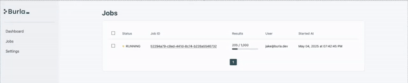

---
layout:
  title:
    visible: false
  description:
    visible: false
  tableOfContents:
    visible: true
  outline:
    visible: false
  pagination:
    visible: true
---

# Welcome



#### Sign up now:



#### Burla is an open-source, batch-processing platform for Python developers.

* Burla can deploy a simple python function to 10,000VM's in about 2 seconds (see our [demo](https://www.youtube.com/watch?v=1HQkTL-7_VY)).
* Code runs in any docker container, on any machine type, for any length of time.
* It comes with a dashboard to monitor long running batch jobs, and view logs.
* Burla can be installed with [one command](installation.md).

#### Burla is a python package with only one function:

```python
from burla import remote_parallel_map


def my_function(my_input):
    print("I'm running on remote computer in the cloud!")
    
remote_parallel_map(my_function, [1, 2, 3])
```

This code runs: `my_function(1)`, `my_function(2)`, `my_function(3)` in parallel, each in a separate container, and on a separate cpu, in the cloud.

With Burla, running code in the cloud feels the same as coding locally:

* Anything you print appears your local terminal.
* Exceptions thrown in your code are thrown on your local machine.
* Responses are pretty quick, you can call a million simple functions in a couple seconds.

#### Burla manages long-running jobs:

Simply add `background=True`&#x20;

```python
remote_parallel_map(my_function, my_inputs, background=True)
```

And `remote_parallel_map` will return as soon as your function and inputs are uploaded.\
Then you can close your laptop, and monitor progress from the dashboard:

<figure><figcaption></figcaption></figure>

***

Questions?\
[Schedule a call with us](http://cal.com/jakez/burla), or email **jake@burla.dev**. We're always happy to talk.

