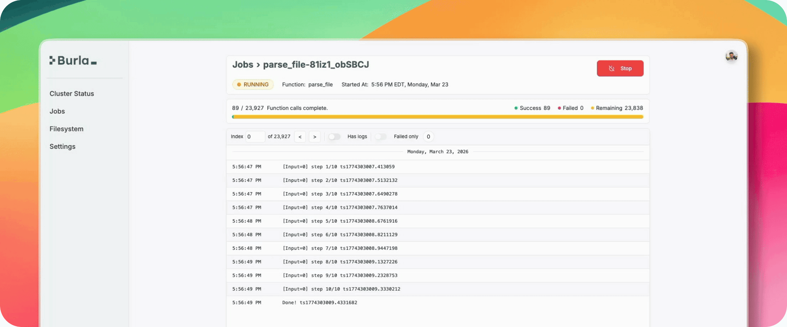

---
layout:
  width: default
  title:
    visible: false
  description:
    visible: false
  tableOfContents:
    visible: true
  outline:
    visible: false
  pagination:
    visible: false
  metadata:
    visible: false
  tags:
    visible: true
---

# Home

## Scale Python across 1,000 computers in 1 second.

Burla is an open-source cloud platform for Python developers. It only has one function:

```py
from burla import remote_parallel_map

my_inputs = list(range(1000))

def my_function(x):
    print(f"[#{x}] running on separate computer")

remote_parallel_map(my_function, my_inputs)
```

This runs `my_function` on 1,000 vm's in the cloud, in < 1 second:

<figure><figcaption></figcaption></figure>

## The simplest way to build scalable data-pipelines.

Burla scales up to 10,000 CPUs in a single function call, supports GPUs, and custom containers.\
Load data in parallel from cloud storage, then write results in parallel from thousands of VMs at once.

```python
remote_parallel_map(process, [...])
remote_parallel_map(aggregate, [...], func_cpu=64)
remote_parallel_map(predict, [...], func_gpu="A100")
```

This creates a pipeline like:

<figure><figcaption></figcaption></figure>

### Monitor progress in the dashboard:

Cancel bad runs, filter logs to watch individual inputs, or monitor output files in the UI.

<figure><figcaption></figcaption></figure>

## How it works:

With Burla, **running code in the cloud feels the same as coding on your laptop:**

```python
return_values = remote_parallel_map(my_function, my_inputs)
```

When functions are run with `remote_parallel_map`:

* Anything they print appears locally (and inside Burla's dashboard).
* Any exceptions are thrown locally.
* Any packages or local modules they use are (very quickly) cloned on remote machines.
* Code starts running in under one second! Even with millions of inputs or thousands of machines.

### Features:


{% column width="50%" %}
**📦 Automatic Package Sync**

Burla automatically (and very quickly) clones your Python packages on every remote machine where code is executed.

**🐋 Custom Containers**

Easily run code in any Docker container.\
Public or private, just paste an image URI in the settings, then hit start!


{% column width="50%" %}
**📂 Network Filesystem**

Need to get big data into/out of the cluster? Burla automatically mounts a cloud storage bucket to a folder in every container.

**⚙️ Variable Hardware Per-Function**

The `func_cpu` and `func_ram` args make it possible to assign big hardware to some functions, and less to others.



***

## Pricing:


{% column width="50%" %}
### Self-Hosted (in your cloud)

<div align="center"><figure><figcaption></figcaption></figure></div>

**Pricing:**

* Free for non-commercial use.
* $100/mo per commercial user.\
  First month free.

Burla can be deployed using one command.\
Learn more at: [How to Self-Host Burla](get-started.md#quickstart-self-hosted-runs-in-your-cloud)


{% column width="50%" %}
### Managed (in Burla's cloud)

<figure><figcaption></figcaption></figure>

**Compute**

* 100% Identical pricing to [Google Cloud](https://cloud.google.com/pricing).
* First $500 free for commercial users.
* First $50 free for non-commercial.

**Platform:**

* $100/mo per user. First month free.



### Try Burla for Free, using 1,000 CPUs!

1. [Sign in](https://login.burla.dev/) using your Google or Microsoft account.
2. Run the quickstart in this Google Colab notebook:  ( Takes less than 2 minutes! )




***

Questions?\
[Schedule a call](http://cal.com/jakez/burla), or email **jake@burla.dev**. We're always happy to talk.
