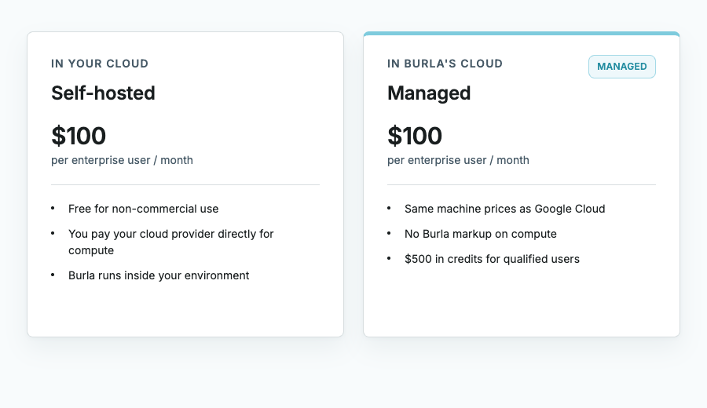

---
layout:
  width: default
  title:
    visible: false
  description:
    visible: false
  tableOfContents:
    visible: true
  outline:
    visible: false
  pagination:
    visible: false
  metadata:
    visible: false
  tags:
    visible: true
---

# Home

## Scale Python to 1000s of VMs with 90% utilization.

Burla is a self-hostable compute platform. We make it fast, simple, and efficient to scale anything.\
Run embeddings, inference, ML-pipelines, and more with a better DX, and 2-5x boost in efficiency.

Burla only has one function:

```py
from burla import remote_parallel_map

my_inputs = list(range(1000))

def my_function(x):
    print(f"[#{x}] running on separate computer")

remote_parallel_map(my_function, my_inputs)
```

This example runs `my_function` on 1000 VMs in less than one second:

<figure><figcaption></figcaption></figure>

## Stop gluing cloud services together.                                  It's 2026, self-hosted infrastructure is trivial now.

Simply define the hardware or container you need inside your code next to the function that needs it.\
Burla can scale up to 10,000 CPUs in a single function call, thousands of GPUs, and any container.

This code:

```python
remote_parallel_map(process, [...], image="rocker/geospatial:latest")
remote_parallel_map(aggregate, [...], func_cpu=64)
remote_parallel_map(predict, [...], func_gpu="A100")
```

Creates a data-pipeline like:

<figure><figcaption></figcaption></figure>

## Infra that manages itself is over twice as efficient.

Burla vertically scales hardware available to each function call live while the program is running.\
This frequently more than doubles compute efficiency, and eliminates out of memory errors.

<figure><figcaption></figcaption></figure>

```python
remote_parallel_map(..., func_ram="dynamic", func_cpu="dynamic")
```

Few workloads use 100% CPU the entire time they run. Burla automatically puts extra space to use.\
Read [our blog post](blog/dynamic-hardware.md) to learn more about dynamic hardware.

## Remote development, local feel.

Running code in the cloud shouldn't feel any different from running code locally.

```python
return_values = remote_parallel_map(my_function, my_inputs)
```

When a Python function is run using `remote_parallel_map`, it runs in the cloud but:

* Anything it prints appears locally (and inside the dashboard).
* Any exceptions are thrown locally.
* Any packages or local modules are (very quickly) cloned on all remote machines.
* Code starts running in under one second! Even with millions of inputs, or thousands of machines.

## A full platform for managing compute infrastructure.

Burla has all the features you need to seamlessly scale up and monitor any workload.\
Manage data-pipelines, filter logs, upload/download files in our network filesystem, and much more.

<figure><figcaption></figcaption></figure>

## Pricing:

Zero compute markup.\
Burla is $250/month per enterprise user, and free for everyone else.

<figure><figcaption></figcaption></figure>

## Run your first 1000-CPU job in 2 minutes:

Zero setup required. Sign in, open the Colab, and follow along. It's only 4 steps!

1. [Sign in](https://login.burla.dev/) using your Google or Microsoft account.
2. Run the quickstart in this Google Colab notebook:



***

Questions?\
[Schedule a call](http://cal.com/jakez/burla), or email **jake@burla.dev**. We're always happy to talk.
