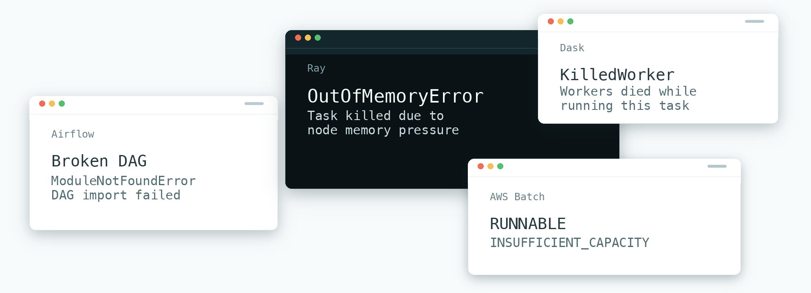

---
layout:
  width: default
  title:
    visible: false
  description:
    visible: false
  tableOfContents:
    visible: true
  outline:
    visible: false
  pagination:
    visible: false
  metadata:
    visible: false
  tags:
    visible: true
  actions:
    visible: true
---

# Home

## Scale Python to 1,000 VMs in your cloud in 1 second.

Burla is a self-hostable compute platform for scaling big data workloads in your cloud.\
Run analysis, inference, embeddings, and more with instant feedback, and 2-5x higher utilization.

Burla only has one function:

```py
from burla import remote_parallel_map

my_inputs = list(range(1000))

def my_function(x):
    print(f"[#{x}] running on separate computer")

remote_parallel_map(my_function, my_inputs)
```

This example runs `my_function` on 1,000 VMs in less than one second:

<figure><figcaption></figcaption></figure>

## Scalable & efficient pipelines are not straightforward.

Slow deployments, VM reboots, or container rebuilds mean waiting 5-10 minutes with every change.\
Errors are vague, and configs are full of secret tradeoffs. 90% resource utilization is a pipe dream.

<figure><figcaption></figcaption></figure>

## Burla can scale any workload with a single function.

Easily fan Python in/out across thousands of machines with varying sizes, types, and environments.\
Quickly develop pipelines that handle 100+ TB datasets, using simple code anyone can understand.

This code:

```python
remote_parallel_map(process, [...], image="rocker/geospatial:latest")
remote_parallel_map(aggregate, [...], func_cpu=64)
remote_parallel_map(predict, [...], func_gpu="A100")
```

Creates a pipeline like:

<figure><figcaption></figcaption></figure>

Burla automatically manages it's own pool of VMs underneath to maximize speed and efficiency.\
Not only is this easier (no YAML, or config footguns), it's fundamentally more compute efficient.


## With Burla, the same jobs use 50% less compute.

Burla vertically scales hardware available to each function call live while the program is running.\
This frequently more than doubles compute efficiency, and eliminates out of memory errors.

<figure><figcaption></figcaption></figure>

```python
remote_parallel_map(..., func_ram="dynamic", func_cpu="dynamic")
```

This system is possible due to Burla's unique architecture lacking a traditional master node.\
Read [our blog post](blog/dynamic-hardware.md) to learn more about dynamic hardware.


## How it works:

Running code in the cloud shouldn't feel any different from running code locally.

```python
return_values = remote_parallel_map(my_function, my_inputs)
```

When a Python function is run using `remote_parallel_map`, it runs in the cloud but:

* Anything it prints appears locally (and inside the dashboard).
* Any exceptions are thrown locally.
* Any packages or local modules are (very quickly) cloned on all remote machines.
* Code starts running in under one second! Even with millions of inputs, or thousands of machines.

Code runs on a pool of VM's that are automatically managed by Burla to maximize efficiency.\
You can manually add & remove machines from the pool, or let the platform react live to requests.


## Everything you need to scale & monitor your workload.

Keep an eye on your analysis, pipeline, or background job from your phone.\
Burla has all the features you need to closely monitor logs, output files, and available compute.

<figure><figcaption></figcaption></figure>

## Pricing:

Zero markup on compute.\
Burla is $250/month per enterprise user, and free for everyone else.

<figure><figcaption></figcaption></figure>

#### Want to learn more? [Book a call](https://cal.com/jakez/burla?user=jakez) for a conversation with the people who built it.

***

Questions?\
[Schedule a call](http://cal.com/jakez/burla), or email **jake@burla.dev**. We're always happy to talk.
