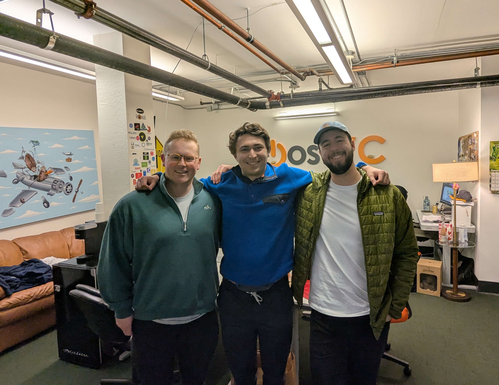
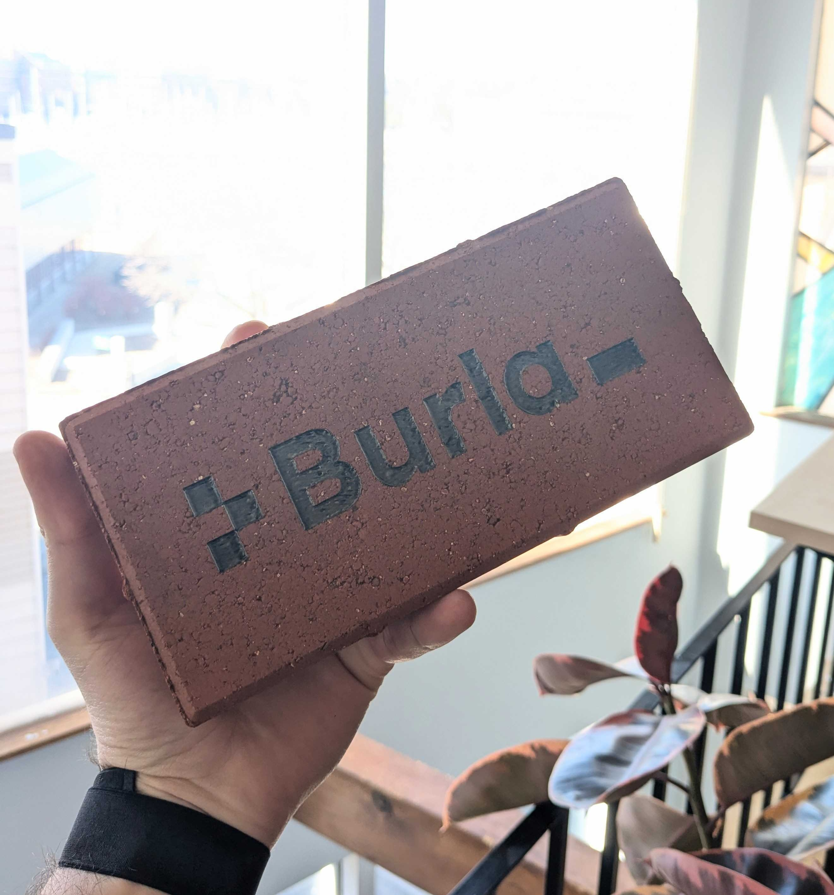

# About

### Why?

Developers have the most fun, and are most productive, when they get into a "flow state".

If you’ve spent any time working with modern cloud infrastructure, you’ll know it can often be slow, unclear, and difficult to debug. These are all things that make it difficult to enter or stay inside a flow state. These things make work both less fun, and a lot less productive.

We’ve created Burla with the goal of making cloud infrastructure fun.\
This means Burla will need to be simple, really fast, and very easy to debug, even if you’re building something complicated. We believe that whether you're coding locally, or on a cluster of 1000 machines, infrastructure should update and react quickly, like under-a-second quickly. We should be able to iterate at the speed of thought, not at the speed my lambda function, batch workload, ETL-pipeline, or Kubernetes service takes to redeploy!\

### About Us:

We're three lifelong friends with some experience working on cloud-infrastructure at startups.

<figure><figcaption>
Joe Perry, Jack Rzucidlo, and Jake Zuliani (in order) at the BoostVC office in San Mateo.
</figcaption></figure>

### Burla is backed by:

<figure><figcaption>
Pioneer.app
</figcaption></figure> <figure><figcaption>
Boost.vc
</figcaption></figure> <figure><figcaption>
bvp.com/bessemer-beam
</figcaption></figure>

<figure><figcaption>
cloud.google.com/startup
</figcaption></figure>

&#x20;

## Buy our Brick!

Buy a Brick, get 10% off for life.

### Why are you selling bricks?

At Burla.dev, our mission is to make cloud infrastructure fun.\
We enable rapid progress using a single primitive:  `remote_parallel_map`\
What's more fun than rapid progress?\
\
To symbolize this, we're offering bricks—a fundamental primitive of construction.\
By purchasing a brick, you support our mission and become part of a community.\
A community that together, is build the future of cloud computing, one brick at a time!

<figure><figcaption></figcaption></figure>

### [Buy a brick:](https://buy.stripe.com/fZe5lp30B3fKdgc5km) $1000

(10% Lifetime discount)

* Bricks are customized (on the back) with your name or company name, and a sequential serial number to identify it.
* Bricks grant you direct support from [us](about.md) in our private slack, or by phone 24/7.
* Every brick comes with a handwritten note from [us](about.md), the founders.
* Most importantly Bricks really do grant you 10% off any current or future Burla products **for life** which is a really good deal!

&#x20;

&#x20;

***

Questions?\
[Schedule a call with us](http://cal.com/jakez/burla), or email **jake@burla.dev**. We're always happy to talk.
