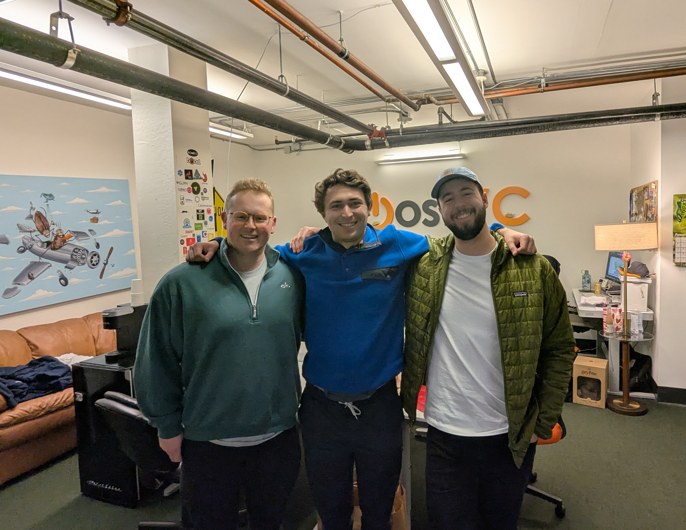

# About

### Why?

Developers have the most fun, and are most productive, when they get into a "flow state".

If you’ve spent any time working with modern cloud infrastructure, you’ll know it can often be slow, unclear, and difficult to debug. These are all things that make it difficult to enter or stay inside a flow state. These things make work both less fun, and a lot less productive.

We’ve created Burla with the goal of making cloud infrastructure fun.\
This means Burla will need to be simple, really fast, and very easy to debug, even if you’re building something complicated. We believe that whether you're coding locally, or on a cluster of 1000 machines, infrastructure should react quickly, like under-a-second quickly. We should be able to iterate at the speed of thought, not at the speed my lambda function, batch workload, ETL-pipeline, or Kubernetes service take to redeploy! 

### About Us:

We're three lifelong friends with some experience working on cloud-infrastructure at startups.

<figure><figcaption>
Joe Perry, Jack Rzucidlo, and Jake Zuliani (in order) at the BoostVC office in San Mateo.
</figcaption></figure>

### Burla is backed by:

<figure><figcaption>
Pioneer.app
</figcaption></figure> <figure><figcaption>
Boost.vc
</figcaption></figure> <figure><figcaption>
bvp.com/bessemer-beam
</figcaption></figure>

***

Questions?\
[Schedule a call with us](http://cal.com/jakez/burla), or email **jake@burla.dev**. We're always happy to talk.
