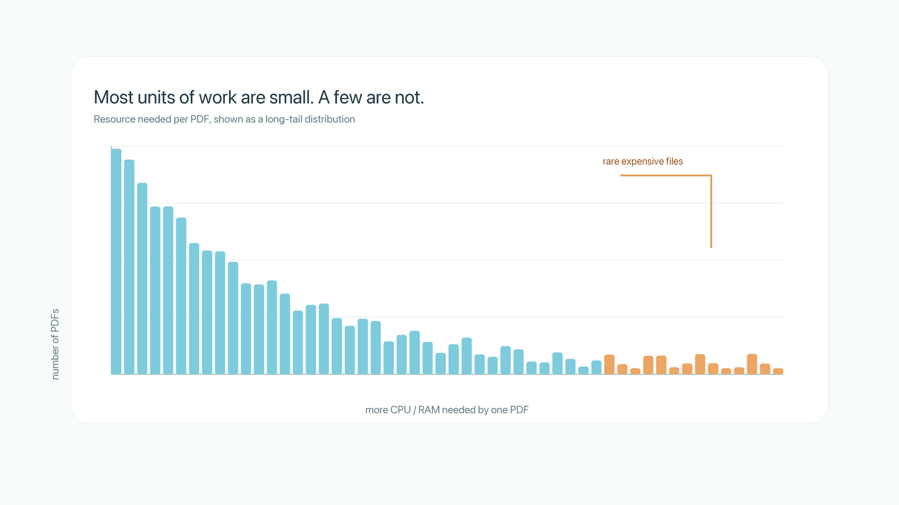
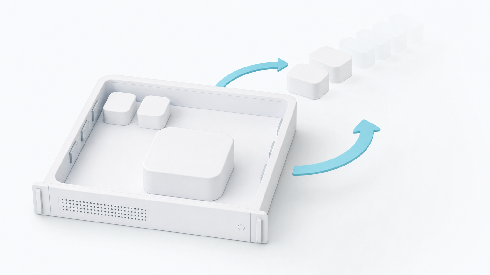
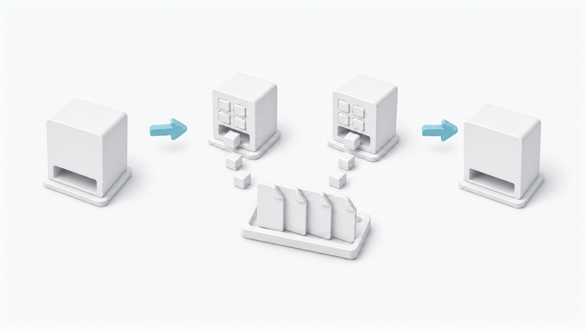

# You should never need to estimate how much CPU or RAM you need.

This might sound crazy but it's true. The reason why has nothing to do with our ability to guess.

The real reason is that modern cloud schedulers with access to live resource use information can vertically scale available CPU and RAM per workload in realtime, massively boosting efficiency, and eliminating memory errors.

This violates one of the most basic assumptions of modern cloud computing: before you run a workload, you need to describe the hardware it should run on. Not only is this unnecessary, it forces you into a static box, where more useful work frequently _could_ happen but doesn't. How often does your workload use 100% CPU or RAM? [Estimates](https://www.datacenterdynamics.com/en/news/only-13-of-provisioned-cpus-and-20-of-memory-utilized-in-cloud-computing-report/) put average utilization below 25%.

Let's clarify with a simple example. A data science team wants to parse 10,000 PDFs. Some are short. Some are enormous. Some are malformed. Some require much more memory, and many require very little. The job is clear: parse the PDFs. But the infrastructure interface asks a different question: how much CPU and RAM should each worker get? How many machines should I use? Should I batch all the big ones separately? or add a new cleaning step to avoid wasting resources?

We shouldn't need to think about these things. Not because it's annoying (which it is), but because even if you guess perfectly, the large PDF's will still sit at 10% CPU for an hour before quickly spiking to 100%, and that extra space could have been put to use processing small PDFs.

The traditional interface is:

> Run this code on this hardware.

An ideal interface should be closer to:

> Run this code.

The system should figure out the hardware while the job is running.

## Problems with guessing

When you choose fixed resources upfront, there are only three possible outcomes:

1. You set CPU and RAM too low.\
   Then the job fails with out-of-memory errors, or it becomes mysteriously slow because memory spills to disk. The second case is often worse than the first. A crash is visible, swap is quiet. A pipeline that should take minutes can become a pipeline that takes hours, and nothing in your code necessarily looks wrong.
2. You set CPU and RAM too high.\
   Then the job runs, but VMs are full of reserved capacity that nobody is using. You are paying for machines that are sitting partly empty.
3. You set CPU and RAM perfectly.\
   This still loses, because different tasks require different resources. In the PDF example, a fixed worker size has to serve tiny PDFs and giant PDFs. If you size every worker for the giant PDFs, the tiny PDFs waste memory. If you size every worker for the tiny PDFs, the giant PDFs fail or crawl. Not to mention, within some single task resource use can vary drastically, and that space could be put to use!

<figure><figcaption>
Most parallel jobs are not made of identical work items. A fixed resource request has to pretend they are.
</figcaption></figure>

The system is asking the user to predict something that will only become visible during execution.\
This is hard to guess correctly, even if you do you're still leaving capacity on the table.

## "Dynamic Hardware"

A running machine cannot magically grow more CPUs or RAM.\
However, the number of workers running on that machine can change.

Dynamic hardware does not mean that a single computer literally changes size every second. It means that the effective resources available to each unit of work change while the job runs.

Burla workers (docker containers) do not have fixed CPU and RAM limits inside a machine. If a machine has many workers, they share resources. If some workers are removed, the remaining workers have more CPU and RAM available to them. If more workers are added, the available resources per worker decrease.

Burla can control the hardware available to each task by controlling concurrency.

<figure><figcaption>
Burla does not resize a running computer. It resizes the amount of work competing for that computer.
</figcaption></figure>

Burla starts aggressively, with one worker per available CPU. If CPU and RAM utilization is low, Burla adds workers. Those workers pull more inputs from the queue and start doing useful work.

When the machine saturates, Burla removes workers. For CPU, saturation means the entire machine is (almost) out of available CPU capacity, not that a single core is busy. For memory, this means RAM is close to spilling onto disk. When a worker is killed, the input it was processing goes back onto the queue, where another worker can pick it up later.

This is how Burla adjusts CPU and RAM available to each task during runtime. It does not resize a running computer. It resizes the amount of work competing for that computer.

## Killing work increases efficiency

At first, this sounds inefficient. A worker may run for a while, get killed, and have its input retried later. Isn't that wasted work? Technically yes, effectively no.

Because the worker was running in capacity that otherwise would have been unused, this is not waste. If it finishes before the machine becomes saturated, the job has made progress. If it does not finish, the input returns to the queue. Retry overhead is tiny, and this results in an overall large efficiency gain for average workloads.

The alternative is not "run the task perfectly." The alternative is to leave that CPU or RAM unused.

Dynamic hardware uses extra capacity speculatively. Some speculative work completes. Some is evicted and retried. But because it runs only while extra space is available, it does not reduce the speed of any work already using that machine.

Static schedulers reserve for uncertainty. They must choose a fixed worker count, a fixed worker size, or fixed resource requests before they know what the tasks will actually do. That leaves unused capacity whenever the guess is conservative. Dynamic hardware uses idle capacity while it exists. If the extra work finishes, utilization improves. If the extra work is evicted, the system has lost nothing.

## "Dynamic Hardware" requires horizontal autoscaling

Adjusting worker count inside a machine can vertically scale the CPU/RAM available to each worker. To make this actually useful the scheduler must also add and remove machines during runtime.

Every job has some maximum allowed number of parallel workers, either set by the user to limit DB connections / API spam, or the systems global resource limit. Burla is always trying to hit the maximum number of parallel workers, even if this includes adding hardware, because more workers means a faster job at the same price.\
\
For example, assuming a price of $0.05 per CPU hour:

* 100 CPUs for 10 hours is $50
* 1000 CPUs for 1 hour is also $50, but the job finishes 10x faster.

When Burla removes workers on a machine to free up resources, the total number of parallel workers goes down. In this scenario, Burla will boot and add more machines while the job is running to maintain maximum parallelism.

Inversely, when Burla adds workers to a machine to increase utilization, it must remove workers elsewhere to stay below the job's maximum allowed parallelism. This is how Burla directly saves you money, by packing more workers into less machines where possible, and removing any machines that become empty.

<figure><figcaption>
"Dynamic Hardware" is not just adaptive realtime concurrency control. It's adaptive infrastructure for the whole job.
</figcaption></figure>

This is why "Dynamic Hardware" is a useful name even though the mechanism is really concurrency control + horizontal autoscaling.

From the user's perspective, the amount of hardware available to the workload is changing. A worker may effectively get more of a machine when other workers are removed, or less when more workers are added. The job may get more machines when more parallelism is needed, or less when it's not.

Simoultainously, dynamic hardware provides a massive boost in resource efficiency, and simplifies the users job.

## What's the catch?

There is one important constraint: workloads must be able to be retried (they must be idempotent).

If a worker dies while parsing a PDF, that PDF may be parsed again later. The program must work correctly even if the same input is attempted more than once.

For the majority of data workloads, this is already true. Parsing documents, embedding text, transforming files, running inference, or computing independent outputs. This is less appropriate for code that mutates shared external state without safeguards, like processing payments, or other things that cannot safely happen more than once.

## Infrastructure is better when it handles itself.

The old interface asks the user to translate intent into infrastructure:

> I want to parse these PDFs, so I need to decide how many machines to start, how much RAM each worker needs, how much CPU to allocate, whether to split this into batches, etc.

Dynamic Hardware removes that translation step.

The user says:

> Parse these PDFs.

Burla watches the workload as it actually behaves. It fills idle CPU and RAM with useful work. It backs off when a machine saturates. It gives large tasks more room by removing smaller ones. It adds VMs when the job needs more parallelism and removes them when they aren't needed.

The result is not merely easier. It is structurally more efficient than asking a person to guess.

A person choosing fixed resources upfront has less information than the system observing the job at runtime. The person sees the code and maybe a few examples. The system sees the actual CPU pressure, actual memory pressure, actual task distribution, and the actual long tail as it happens.

This is how infrastructure should be. User's define the work they want to happen, and the system figures out how to make it happen as quickly and efficiently as possible.

Not only is this much easier (no more guessing) it frequently yields a 2-5x improvement in resource utilization, on what are often some of the most expensive and resource intense jobs happening inside a company. This means you can do 2-5x more work with the same resources, or pay 50-80% less for the same job, all while staying focused on your code, instead of infra config.

We shouldn't specify:

> Run X code on Y hardware.

We should just say:

> Run X code.

And let the scheduler handle the rest.
