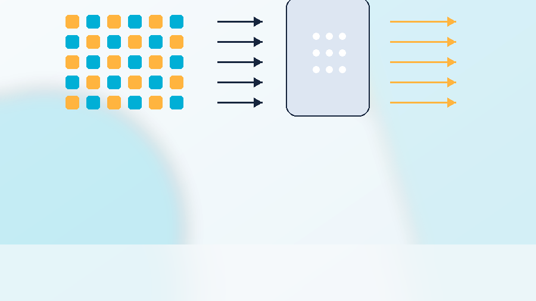
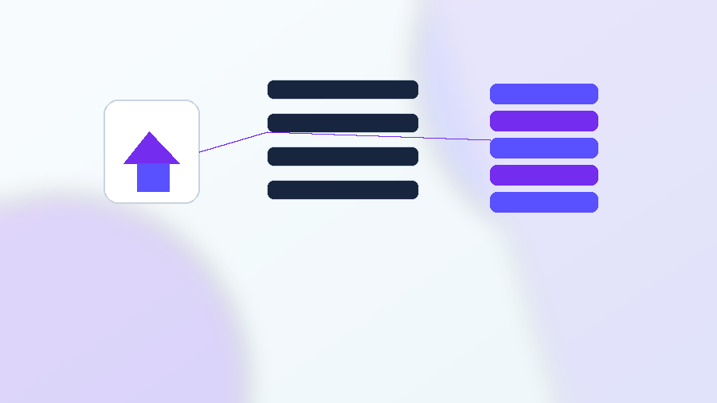
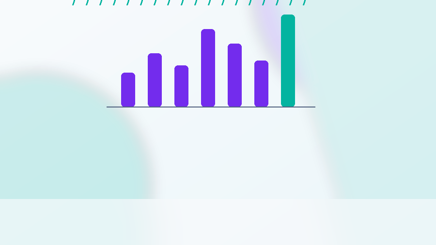
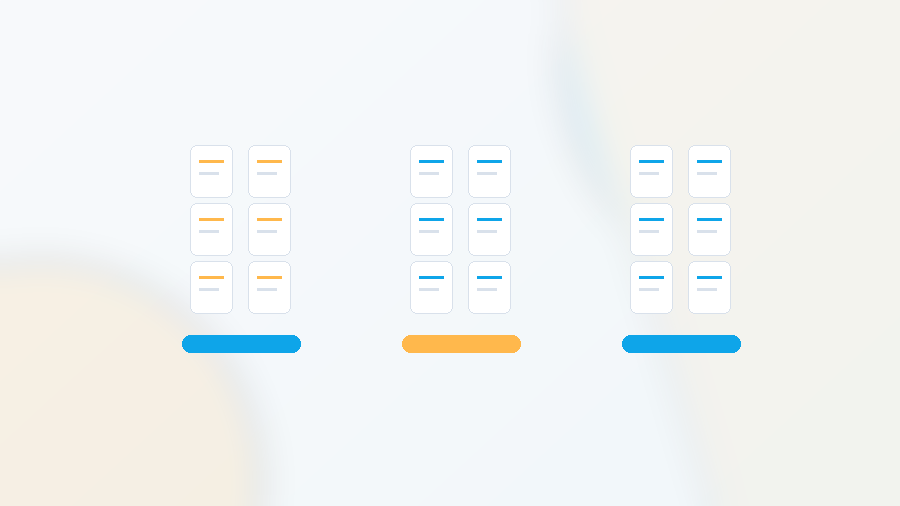
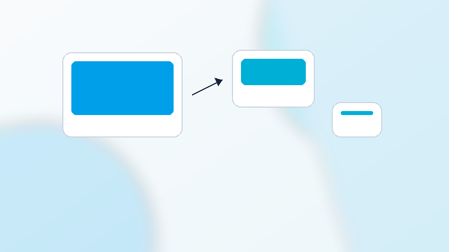
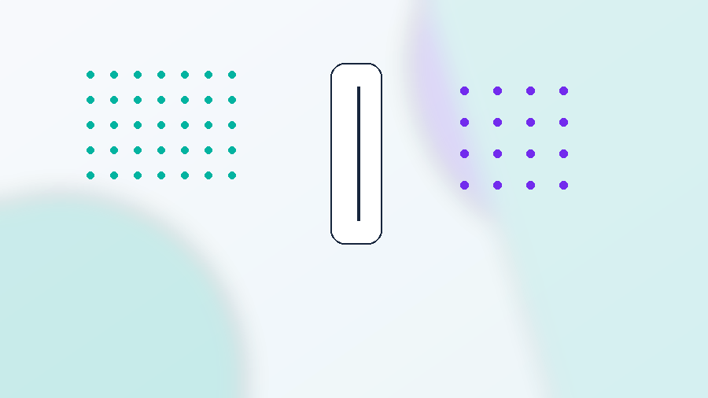
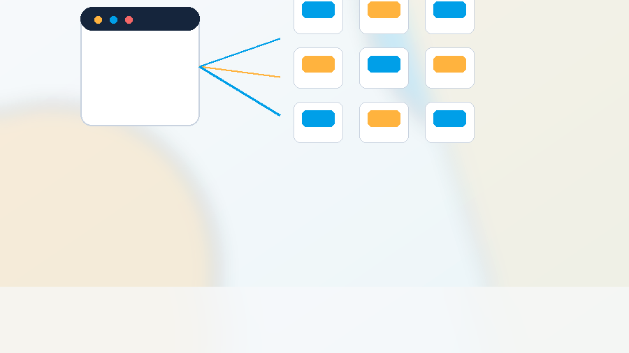
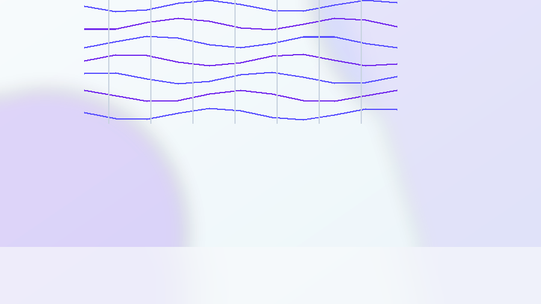
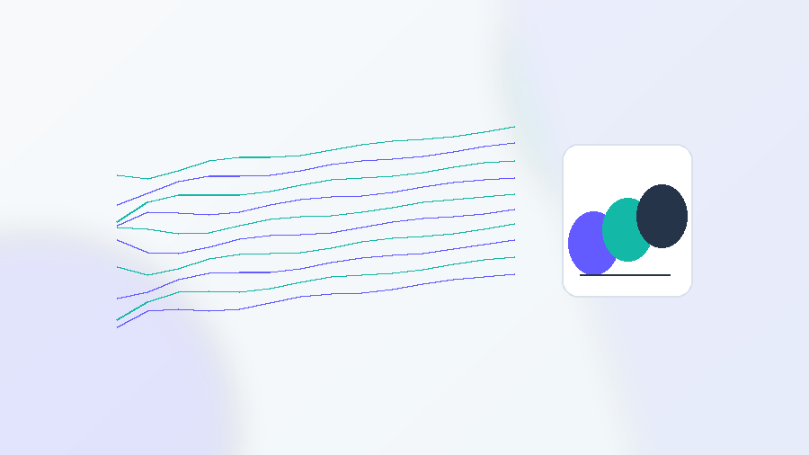

Real Burla workloads for ML, data pipelines, production IO, and scientific computing.

## ML, embeddings, and search

  <a href="https://docs.burla.dev/examples/demo-walkthroughs/gpu-embedding-demo.md" style="display:block;border:1px solid #e6edf0;border-radius:8px;padding:12px 13px;text-decoration:none;color:inherit;background:#fff;min-height:142px;">
    
    GPU embeddings on A100s
    Embed 50,000 Wikipedia articles with a CUDA image, CPU download stage, GPU embedding stage, and shared vector artifacts.
  </a>
  <a href="https://docs.burla.dev/examples/demo-walkthroughs/ml-inference-batch.md" style="display:block;border:1px solid #e6edf0;border-radius:8px;padding:12px 13px;text-decoration:none;color:inherit;background:#fff;min-height:142px;">
    
    Batch inference without serving
    Load a Hugging Face model once per worker and score Parquet batches without building an endpoint.
  </a>
  <a href="https://docs.burla.dev/examples/demo-walkthroughs/arxiv-fossils.md" style="display:block;border:1px solid #e6edf0;border-radius:8px;padding:12px 13px;text-decoration:none;color:inherit;background:#fff;min-height:142px;">
    
    Embed the whole arXiv
    Cluster 2.7M abstracts and find isolated papers by running the embedding job at corpus scale.
  </a>
  <a href="https://docs.burla.dev/examples/demo-walkthroughs/met-weirdest-art.md" style="display:block;border:1px solid #e6edf0;border-radius:8px;padding:12px 13px;text-decoration:none;color:inherit;background:#fff;min-height:142px;">
    
    Label-free visual search over the Met
    Fetch and embed Open Access museum images, then use FAISS to find visual matches without labels.
  </a>
  <a href="https://docs.burla.dev/examples/demo-walkthroughs/airbnb-burla.md" style="display:block;border:1px solid #e6edf0;border-radius:8px;padding:12px 13px;text-decoration:none;color:inherit;background:#fff;min-height:142px;">
    
    Multimodal Airbnb analysis
    Run listings, photos, CLIP, YOLOv8, reviews, and bootstrap confidence intervals across the public corpus.
  </a>

## Full-corpus analysis

  <a href="https://docs.burla.dev/examples/demo-walkthroughs/amazon-review-distiller.md" style="display:block;border:1px solid #e6edf0;border-radius:8px;padding:12px 13px;text-decoration:none;color:inherit;background:#fff;min-height:142px;">
    
    571M Amazon reviews
    Read 275 GB of JSONL with HTTP Range requests, deterministic scoring, and heap-based reducers.
  </a>
  <a href="https://docs.burla.dev/examples/demo-walkthroughs/nyc-ghost-neighborhoods.md" style="display:block;border:1px solid #e6edf0;border-radius:8px;padding:12px 13px;text-decoration:none;color:inherit;background:#fff;min-height:142px;">
    
    NYC taxi history
    Scan 2.76B taxi and FHV trips to find ghost, emergent, and recovered city zones.
  </a>
  <a href="https://docs.burla.dev/examples/demo-walkthroughs/world-photo-index.md" style="display:block;border:1px solid #e6edf0;border-radius:8px;padding:12px 13px;text-decoration:none;color:inherit;background:#fff;min-height:142px;">
    
    9.49M Flickr photos
    Reverse-geocode public photos and build country signatures from user-written tags.
  </a>
  <a href="https://docs.burla.dev/examples/demo-walkthroughs/ghcn-rainiest-day.md" style="display:block;border:1px solid #e6edf0;border-radius:8px;padding:12px 13px;text-decoration:none;color:inherit;background:#fff;min-height:142px;">
    
    NOAA rain extremes
    Stream every yearly GHCN-Daily CSV, keep top heaps, and reduce station-level extremes.
  </a>
  <a href="https://docs.burla.dev/examples/demo-walkthroughs/github-repo-summarizer.md" style="display:block;border:1px solid #e6edf0;border-radius:8px;padding:12px 13px;text-decoration:none;color:inherit;background:#fff;min-height:142px;">
    
    One million GitHub READMEs
    Export README Parquet from BigQuery, shard deterministic summarizers, and reduce category stats.
  </a>

## Production data jobs

  <a href="https://docs.burla.dev/examples/demo-walkthroughs/python-etl-no-airflow.md" style="display:block;border:1px solid #e6edf0;border-radius:8px;padding:12px 13px;text-decoration:none;color:inherit;background:#fff;min-height:142px;">
    
    S3 to Postgres ETL
    Transform 10,000 gzipped JSON files while protecting Postgres with max_parallelism.
  </a>
  <a href="https://docs.burla.dev/examples/demo-walkthroughs/image-dataset-resize.md" style="display:block;border:1px solid #e6edf0;border-radius:8px;padding:12px 13px;text-decoration:none;color:inherit;background:#fff;min-height:142px;">
    
    Millions of image resizes
    Chunk image keys, resize with Pillow, and stream progress as workers write outputs.
  </a>
  <a href="https://docs.burla.dev/examples/demo-walkthroughs/parquet-parallel.md" style="display:block;border:1px solid #e6edf0;border-radius:8px;padding:12px 13px;text-decoration:none;color:inherit;background:#fff;min-height:142px;">
    
    One Parquet file per worker
    Compute per-file QA stats without starting Spark for a simple file-parallel job.
  </a>
  <a href="https://docs.burla.dev/examples/demo-walkthroughs/pandas-apply-parallel.md" style="display:block;border:1px solid #e6edf0;border-radius:8px;padding:12px 13px;text-decoration:none;color:inherit;background:#fff;min-height:142px;">
    
    Pandas apply in parallel
    Partition a Parquet dataset and run ordinary pandas code on each worker.
  </a>
  <a href="https://docs.burla.dev/examples/demo-walkthroughs/rate-limited-api-requests.md" style="display:block;border:1px solid #e6edf0;border-radius:8px;padding:12px 13px;text-decoration:none;color:inherit;background:#fff;min-height:142px;">
    
    Enrich millions of users through a rate-limited API
    Backfill user profiles while keeping provider limits explicit in chunk size, sleeps, and max_parallelism.
  </a>
  <a href="https://docs.burla.dev/examples/demo-walkthroughs/parallel-web-scraping.md" style="display:block;border:1px solid #e6edf0;border-radius:8px;padding:12px 13px;text-decoration:none;color:inherit;background:#fff;min-height:142px;">
    
    Crawl a million website pages without hiding failures
    Scrape static HTML with polite pacing, retries, error rows, and a global concurrency cap.
  </a>

## Scientific and geospatial work

  <a href="https://docs.burla.dev/examples/demo-walkthroughs/bioinformatics-alignment.md" style="display:block;border:1px solid #e6edf0;border-radius:8px;padding:12px 13px;text-decoration:none;color:inherit;background:#fff;min-height:142px;">
    
    Genome alignment
    Run bwa and samtools in a custom image with one FASTQ pair per worker.
  </a>
  <a href="https://docs.burla.dev/examples/demo-walkthroughs/gdal-raster-processing.md" style="display:block;border:1px solid #e6edf0;border-radius:8px;padding:12px 13px;text-decoration:none;color:inherit;background:#fff;min-height:142px;">
    
    GDAL raster processing
    Compute NDVI one Sentinel tile at a time with rasterio and shared outputs.
  </a>
  <a href="https://docs.burla.dev/examples/demo-walkthroughs/monte-carlo-simulation.md" style="display:block;border:1px solid #e6edf0;border-radius:8px;padding:12px 13px;text-decoration:none;color:inherit;background:#fff;min-height:142px;">
    
    Billion-path Monte Carlo
    Return sums and squared sums from independent chunks, then reduce locally.
  </a>

