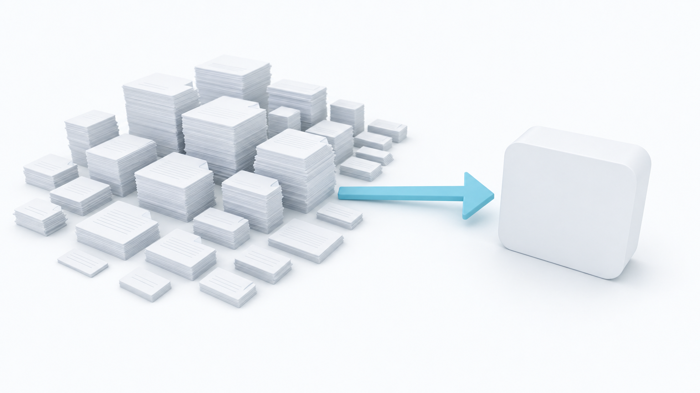
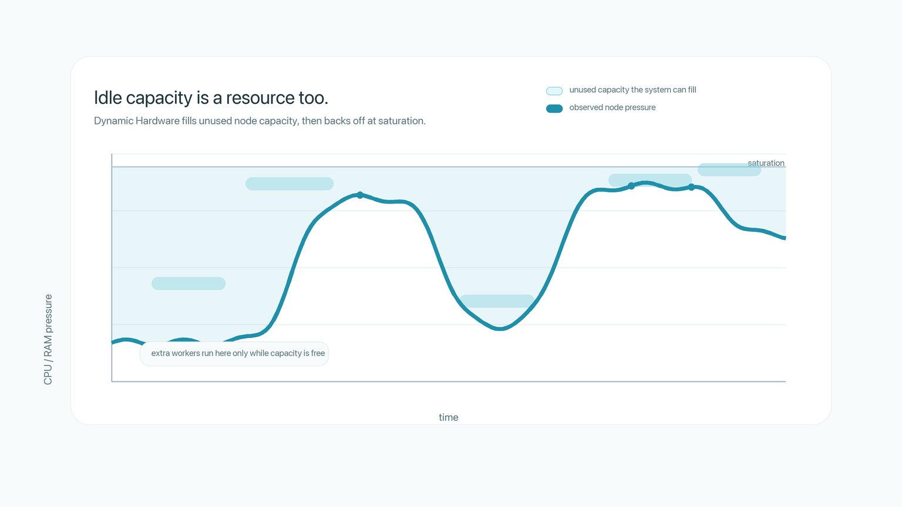

# Hardware Should Be Dynamic

You should not have to estimate how much CPU or RAM your workload needs.

That sentence sounds almost too simple to be interesting. In practice, it cuts against one of the basic assumptions of modern cloud computing: before you run the job, you are expected to describe the hardware it should run on.

A data science team wants to parse 10,000 PDFs. Some are short. Some are enormous. Some are malformed. Some require much more memory because the parser loads large sections into memory. The actual job is clear: parse the PDFs. But the infrastructure interface asks a different question: how much CPU and RAM should each worker get?

That is a strange question to ask the user.

The user does not know the answer. More importantly, the user cannot know the answer in advance, because the answer depends on the PDFs themselves. The resource profile is not a single number. It is a distribution.

<figure><figcaption>
The work is obvious: parse the documents. The hardware profile is what the system should discover.
</figcaption></figure>

The traditional interface is:

> Run this code on this hardware.

Burla's interface should be closer to:

> Run this code.

The system should figure out the hardware while the job is running.

That is the idea behind Dynamic Hardware.

By more efficient, I mean more fully used: CPU and RAM spend more of the job doing useful work instead of sitting idle behind a conservative guess. Higher utilization usually shows up as lower cloud cost, shorter runtime, or both. But the underlying win is simpler than either one: the cluster is closer to full.

## The problem with guessing

When you choose fixed resources upfront, there are only three possible outcomes.

You can set CPU and RAM too low. Then the job fails with out-of-memory errors, or it becomes mysteriously slow because memory spills to disk. The second case is often worse than the first. A crash is visible. Swap is quiet. A pipeline that should take minutes can become a pipeline that takes hours, and nothing in the user's code necessarily looks wrong.

You can set CPU and RAM too high. Then the job runs, but the cluster is full of reserved capacity that nobody is using. You are paying for machines that are sitting partly empty.

Or you can make a guess that is right on average. This still loses, because the average task is not the task currently running.

In the PDF example, a fixed worker size has to serve tiny PDFs and giant PDFs. If you size every worker for the giant PDFs, the tiny PDFs waste memory. If you size every worker for the tiny PDFs, the giant PDFs fail or crawl. If you pick a compromise, both problems remain: some work is overprovisioned, and some work is underprovisioned.

<figure><figcaption>
Most parallel jobs are not made of identical work items. A fixed resource request has to pretend they are.
</figcaption></figure>

This is not a user error. It is a bad abstraction.

The system is asking the user to predict something that will only become visible during execution.

## Hardware is not the thing that needs to be fixed

A running machine cannot magically grow more CPUs or RAM. But the number of workers running on that machine can change.

That is the important move.

Dynamic Hardware does not mean that a single computer literally changes size every second. It means that the effective resources available to each unit of work change while the job runs.

Burla workers do not need fixed CPU and RAM limits inside the node. If a node has many workers, they share the node's resources. If some workers are removed, the remaining workers have more CPU and RAM available to them. If more workers are added, the available resources per worker decrease.

So Burla can control the hardware available to each task by controlling concurrency.

Burla starts aggressively, with one worker per available CPU. If CPU and RAM are still low, Burla adds workers. Those workers pull more inputs from the queue and start doing useful work.

When the node saturates, Burla removes workers. For CPU, saturation means the whole node is out of available CPU capacity, not that a single core is busy. For memory, the danger point is when RAM is exhausted and the system would otherwise start spilling to swap. The input being processed by a removed worker goes back onto the queue, where another worker can pick it up later.

<figure><figcaption>
Burla does not resize a running computer. It resizes the amount of work competing for that computer.
</figcaption></figure>

The eviction policy matters. Burla should evict the workers using the least resources first.

If one worker is parsing a huge PDF and several others are parsing small PDFs, the huge PDF is probably the one that needs the machine. Killing the largest task would be exactly wrong. Burla should remove the smaller workers around it, giving the large task more room to finish. The smaller tasks go back to the queue and can run somewhere else later.

This is the opposite of treating every task as though it deserves the same static slice of the machine.

## Why killing work is not waste

At first, this sounds inefficient. A worker may run for a while, get killed, and have its input retried later. Isn't that wasted work?

Not in the situation Dynamic Hardware is designed for.

The worker was running in capacity that otherwise would have been idle. If it finishes before the node becomes saturated, the job has made progress. If it does not finish, the input returns to the queue. Retry overhead is tiny, and the work item is assumed to be idempotent: it can run more than once without corrupting the result.

The alternative is not "run the task perfectly." The alternative is to leave that CPU or RAM unused because the system is afraid the capacity might be needed later.

Idle capacity cannot be recovered. Once a second of CPU time passes unused, it is gone.

Dynamic Hardware uses that capacity speculatively. Some speculative work completes. Some is evicted and retried. But because it runs only while the node has room, it does not reduce the progress of the work that actually needed the machine.

<figure><figcaption>
Static scheduling leaves uncertainty as empty space. Dynamic Hardware turns that space into useful attempts.
</figcaption></figure>

This is the proof-like core of the argument.

A static scheduler has to reserve for uncertainty. It must choose a fixed worker count, a fixed worker size, or fixed resource requests before it knows what the tasks will actually do. That leaves unused capacity whenever the guess is conservative.

Dynamic Hardware can reproduce the conservative behavior when the machine is full, but it can also use idle capacity while it exists. If the extra work finishes, utilization improves. If the extra work is evicted, the system has lost very little, because the input simply returns to the queue.

Against a human guess or a static scheduler without perfect future knowledge, this is a better position to be in.

The only scheduler that could beat it in principle is an impossible one: a scheduler that already knows exactly how much CPU, RAM, and time every future task will require. Real users do not have that knowledge. Real static schedulers do not have that knowledge either.

Burla can observe what is actually happening.

That is the advantage.

## Dynamic Hardware also means growing the cluster

Worker count inside a node is one layer. The cluster itself can also change.

With `grow=True`, if a job is no longer running at its maximum useful parallelism, Burla can add more nodes while the job is running. Those new nodes join the job, start pulling inputs from the queue, and do more work.

This matters because evicting workers on one node should not mean the whole job slows down. If a few large PDFs force some nodes to reduce their worker count, Burla can compensate by adding more machines. The job keeps moving, and the user does not have to decide in advance how many machines the workload needs.

<figure><figcaption>
Dynamic Hardware is not only worker tuning inside one node. It is runtime infrastructure adaptation for the whole job.
</figcaption></figure>

This is why "Dynamic Hardware" is a useful name even though the mechanism is partly concurrency control.

From the user's perspective, the amount of hardware available to the workload is changing. A worker may effectively get more of a node when other workers are removed. The job may get more nodes when more parallelism is needed. The user does not manage those decisions directly.

They describe the work.

Burla adapts the infrastructure.

## The constraint

There is one important constraint: work items must be idempotent.

If a worker dies while parsing a PDF, that PDF may be parsed again later. The program must be correct even if the same input is attempted more than once.

For many data-parallel workloads, this is a reasonable requirement. Parsing documents, embedding text, transforming files, running inference, or computing independent outputs can usually be structured this way. It is less appropriate for code that mutates shared external state without safeguards.

That tradeoff is worth stating plainly. Dynamic Hardware gets its efficiency by treating unfinished work as retryable. If retrying a unit of work is dangerous, the workload needs a different execution model.

But when work items are idempotent, this is exactly the right trade.

## The interface should be the work

The deeper point is not that Burla chooses better defaults.

Better defaults would still accept the old premise: that the user's job is to think about hardware, and the system's job is to make that slightly less painful.

The old interface asks the user to translate intent into infrastructure:

> I want to parse these PDFs, so I need to decide how many machines to start, how much RAM each worker needs, how much CPU to allocate, and how much parallelism is safe.

Dynamic Hardware removes that translation step.

The user says:

> Parse these PDFs.

Burla watches the workload as it actually behaves. It fills idle CPU and RAM with useful work. It backs off when a node saturates. It gives large tasks more room by removing smaller ones. It adds nodes when the job needs more parallelism.

The result is not merely easier. It is structurally more efficient than asking a person to guess.

A person choosing fixed resources upfront has less information than the system observing the job at runtime. The person sees the code and maybe a few examples. The system sees the actual CPU pressure, actual memory pressure, actual task distribution, and actual long tail as they happen.

That is the real abstraction.

Not "run X code on Y hardware."

Just:

> Run X code.
