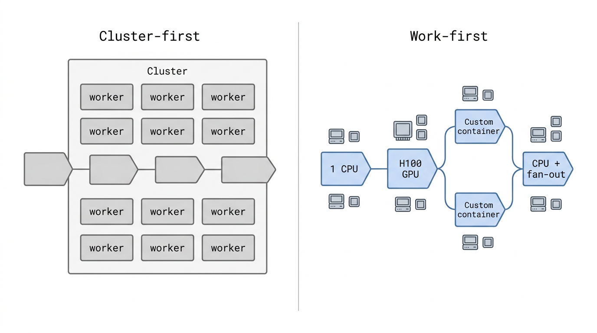

# Stop Designing the Cluster

You want to run a pipeline. Before you can write it, you have to design a cluster.

You pick how many machines it will need, what sizes, which container images, which GPUs, and which scaling rules. Before any code has run, you are being asked to guess the shape of a program you have not written yet.

That should be strange. It isn't, because almost every major distributed computing tool works this way.

## You are writing two programs

Most distributed systems make you write two programs.

The first is the one you actually care about: the pipeline, the transformation, the model, the scoring job, the thing that does the work.

The second is the one nobody explicitly wrote down. It is a guess, made before anything has run, about what infrastructure the first program will need. How many workers. What sizes. Which images. Which kinds of nested work the cluster will tolerate. How much idle capacity to keep warm for branches the code may never take.

The second program is scattered across cluster YAML, autoscaler thresholds, image policy, and a thousand quiet assumptions the team stopped noticing years ago. But it is always there, and it usually ends up deciding whether the first program can be written at all.

That is the bug at the center of modern distributed computing. We have normalized it to the point where it feels like the shape of the problem. It isn't. It is the shape of the tools.

## The pipeline knows things the cluster doesn't

Most interesting workloads do not know their own shape at the start.

A pipeline parses a million documents on cheap CPUs. Three percent of them look suspicious and get routed to a heavier model on H100s. A smaller subset of those needs OCR in a completely different container with a completely different dependency stack. Some of those results explode into per-page work. Others stop there. Later, everything fans back in for aggregation on lightweight boxes.

What exactly is "the cluster" for that program?

If you answer that question before the code runs, you are guessing. You are designing infrastructure for branches the program may never take. You are provisioning around worst-case possibilities instead of actual execution. You are pretending the shape of the computation is already known when the computation is the thing that is supposed to tell you.

This inversion is so built in that we usually do not name it. We name something else. We say the pipeline is "hard to run at scale." We say the team "needs a platform." We reach for more config.

But the config is not the problem. The config is a symptom. The problem is that the runtime has asked us to freeze the shape of the work before writing the work.

## Bad infrastructure shrinks software

The hidden cost of the second program is not the time it takes to write. It is what it quietly removes from the first one.

When infrastructure is awkward, people do not write the system that best matches the problem. They write the system the cluster is willing to run.

They flatten branches that should be dynamic, because dynamic branches require heterogeneous capacity they do not want to manage.

They ship a single giant image with every dependency for every possible stage, because switching images mid-job is not really supported.

They avoid nested parallelism, because nested parallelism deadlocks in systems that reserve resources pessimistically.

They keep expensive hardware warm just in case, because the cost of the right machine not being there at the right moment is too high.

They design around the cluster's limits until the pipeline looks like a compromise instead of an answer.

You see this almost everywhere real distributed work gets done. The clever, branching, data-dependent system sketched on a whiteboard becomes the flat, pessimistically provisioned one that actually ships. Not because the team lacks ambition. Because the tools tax ambition, and that tax is paid in the design phase, silently, long before anyone writes a line of code.

That is the quiet version of the problem. The loud version is that the second program slows teams down. The quiet version is that the second program is choosing what kinds of software get built at all.

## This shift has already happened everywhere else

Go up the stack one level and this fight is already over.

You do not plan which network path your HTTP request will take. You make the request.

You do not tell your language runtime which pages of memory to give you. You allocate.

You do not tell your database which disk blocks to lay your rows on. You insert.

In each case, a lower-level system that once required manual planning quietly became something the runtime just figures out. The lower layers still exist. Experts still reach down when they have to. But the default moved up, and a much larger population of developers got to build useful software as a result.

Distributed computing is overdue for the same shift.

We do not need better cluster YAML. We need fewer reasons to think in cluster YAML at all.

## Infrastructure as a consequence, not a prerequisite

The fix is not subtle.

A distributed program should be able to say: run this function over these inputs, with these resources. If the next stage needs different resources, give it different resources. If a remote step discovers more work, let it launch that work. When the job is done, tear everything down.

Below that line, the runtime should handle the rest.

Machines appear because the computation requires them. Containers are selected because the step requires it. Parallelism rises and falls because the data rises and falls. And when the workload narrows, the infrastructure narrows with it.

This is not an autoscaler bolted onto the side of cluster-first tooling. It is a different default. Infrastructure stops being something the developer plans and becomes something the runtime produces on demand.

<figure><figcaption><p>Cluster-first: the pipeline is reshaped to fit the cluster. Work-first: the cluster is produced to fit the pipeline.</p></figcaption></figure>

Once you see the program as the source of truth and the cluster as a consequence of it, a lot of things snap back into the right place. Pipelines can change hardware mid-run. Stages can switch containers. Remote work can launch more remote work. A step can discover that one input should explode into ten thousand more, and that can just happen, without the developer negotiating with a scheduler.

None of that should feel exotic. That is what dynamic software looks like when the runtime gets out of its way.

## What this actually unlocks

The biggest payoff here is not convenience. It is the software that becomes possible to build.

When every dynamic branch implies infrastructure choreography, teams quietly stop building dynamic systems. When nested fan-out is risky, nobody writes recursive pipelines. When switching images mid-job is not supported, nobody tries.

Over time, the tools silently shape the ambition. Teams ship the small, flat, safely provisioned version of the system they originally had in mind.

Better abstractions do the opposite. They expand the set of programs people are willing to write. Recursive pipelines stop being research projects. Hardware can change between stages without a platform conversation. Expensive compute shows up only when the data actually justifies it. Teams spend their time on the part that matters: the logic of the work.

That is the real prize. Not lines of YAML saved. A larger universe of software that is reasonable to attempt.

## The bet behind Burla

This is the bet behind Burla. We are building the runtime that takes the cluster out of the developer's hands.

Its only primitive is `remote_parallel_map`. You hand it a function, a list of inputs, and the resources that step needs. CPU. RAM. GPU. An image if you want one. Burla handles the rest.

```python
from burla import remote_parallel_map

chunks = remote_parallel_map(
    preprocess, raw_files,
    func_cpu=1, func_ram=2, grow=True,
)

embeddings = remote_parallel_map(
    embed, chunks,
    func_gpu="H100_80G",
    image="gcr.io/acme/pytorch-2.3-cu12",
    grow=True,
)

remote_parallel_map(
    write_results, embeddings,
    func_cpu=1, func_ram=4,
)
```

Stage one runs on cheap CPUs. Stage two runs on H100s in a custom container. Stage three goes back to lightweight machines. Nobody designed a cluster that had to hold all three shapes at once. The pipeline decided the infrastructure as it went, and the infrastructure quietly disappears when the work is done.

A Burla function can also call `remote_parallel_map` itself. When a remote step discovers that one input should become ten thousand, it launches that work directly. Nested fan-out is not a scheduling hazard to be carefully avoided. It is just more computation.

That is the whole idea. The program expresses what should happen. The runtime produces the infrastructure that lets it happen. Nothing below that line belongs in the developer's head.

## The cluster was always supposed to be the implementation detail

Cloud tooling is still stuck halfway up the ladder.

We went from racks to instances, from instances to containers, from containers to schedulers and managed clusters and autoscalers. All of that was real progress. But the developer experience still assumes you should be thinking about worker pools, warm capacity, node types, placement, and images before you can cleanly express what you want to run.

That is better than bare metal. It is not the end state.

The end state is not "infrastructure, but more automated." The end state is that, for a large class of workloads, infrastructure recedes from the foreground. You describe the work. You describe the resources each step needs. The runtime turns that into machines, images, GPUs, parallelism, and teardown.

Not because developers no longer care about performance or control. Because the abstraction finally moved high enough that they do not have to start there.

The cluster was never supposed to be the thing you were designing.

It was supposed to be the thing the runtime figured out after you described the work.
