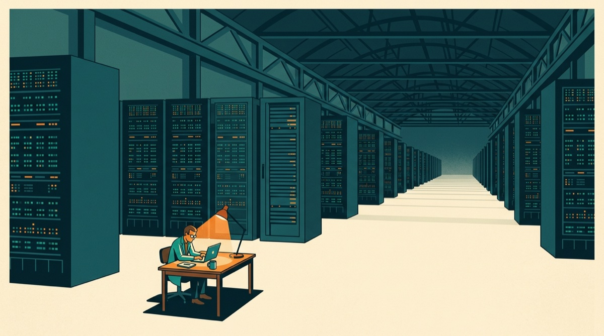

# The Question You Asked Is Not the Experiment You Ran

<figure><figcaption></figcaption></figure>

Suppose someone asks you to build search over all the documents a company has collected over the last ten years.

Not the clean demo corpus. The real pile: contracts, invoices, onboarding PDFs, support exports, scans from an office copier, customer uploads, filenames like `final_v7_USE_THIS_ONE.pdf`.

The question sounds simple: can we make this searchable?

But before you can answer it, another question shows up.

What can I run?

How big a machine do I need? Does the parser image have the right system libraries? Does the embedding image have CUDA? Should this be Spark? Do I need a queue? How expensive will the rerun be if the first parser fails halfway through?

This is where the experiment starts to change.

At the start you wanted to know if search works over the company's documents. By lunch the question has become narrower:

"Does search work over the PDFs that parse cleanly in the container I already have, using one embedding model, evaluated on the examples I can afford to rerun?"

Nobody writes that down. But that is often the experiment that runs.

## The quiet rewrite

The honest version of the document search job is a decision tree.

1. Parse documents.
2. Notice which ones failed.
3. Send scans to OCR.
4. Send table-heavy files to a different parser.
5. Send chunks to GPUs for embeddings.
6. Run a broad eval grid.
7. Rerun low-confidence cases.
8. Build the index from what survived.

That is not exotic. It is what you do after you actually look.

Some PDFs are scans. Some have tables that matter. Some are 900 pages. Some are corrupt. Some are in the wrong language. Some need a vision model. Some should be skipped. Some deserve a slow parser only if a cheap parser thinks they matter.

But this version wants different hardware and different containers at different moments. Cheap CPUs for inspection. An OCR image for scans. A heavier parser for tables. GPUs for embeddings. Maybe a larger memory box for one miserable customer upload.

That is where people compromise.

They sample 500 documents. Skip OCR for now. Use one embedding model. Hand-pick 20 eval questions. Promise to come back later.

The prototype works.

Sort of.

The ugly part is that the long tail is usually the product. The scanned contract, the giant customer upload, the table in the invoice, the weird support export from 2017. Those are the cases users will search for and the benchmark will miss.

This is the real cost of infrastructure friction. It does not merely slow experiments down. It decides which questions survive long enough to be tested.

## Hardware should be control flow

Good experiments escalate. They start cheap, keep the interesting cases, and spend expensive hardware only where the data earns it.

This is how careful people spend attention. Our tools often ask for the spending plan before there is evidence.

So the real question shrinks.

Not:

"What did the data reveal?"

But:

"What fits in the machine I already picked?"

Hardware should be part of the program's control flow. If a branch needs OCR, run it in an OCR container. If another needs CUDA, run it on GPUs. If the next step is a million independent files, fan out across a thousand machines for a few minutes. When the work becomes aggregation, fan back in.

Not a platform migration. Not queue wiring. Not a YAML ceremony.

Code.

```python
profiles = map(inspect_file, files, cpu=2)

parsed = map(parse_pdf, normal_pdfs, image="python:3.12", cpu=4)

ocr_text = map(run_ocr, scanned_pdfs, image="ocr-stack", cpu=16)

embeddings = map(embed, chunks, image="pytorch-cuda", gpu="A100")

scores = map(evaluate, eval_grid, cpu=8)
```

The syntax is not the point. The point is that the decision stayed in the program.

The person writing the pipeline knows why one step needs GDAL, why another needs a GPU, why bad files should be isolated, and why only the winners deserve the expensive pass. That logic belongs in the program.

## What becomes possible

The useful thing is not making the small fake version faster. It is making the real version easier to write.

For model search, do a cascade. Train 10,000 cheap models on small samples. Keep 1,000. Retrain those on more data. Keep 100. Add expensive features. Keep 10. Run calibration and slice analysis. Early stages want cheap CPU parallelism. Later stages may want memory or GPUs.

For RAG evals, run the full matrix: chunk sizes, embedding models, retrieval depths, rerankers, prompts, model versions, judges, datasets. Cheap filters first. Expensive judges later. Evaluate the actual space, not the tiny version that fits in your patience.

For geospatial work, stop building one cursed Docker image with every dependency known to humanity. Tile satellite scenes in an `osgeo/gdal` container. Run segmentation on GPUs. Polygonize on CPUs. Rerun cloudy or low-confidence tiles with a slower path.

These are the programs people would write if infrastructure stopped interrupting.

## Why the usual tools don't quite fix it

Docker answers "can this environment exist somewhere else?" Queues answer "can many copies of this work run?" Spark answers "can this dataframe spread across a cluster?" Workflow engines answer "can this schedule repeat?"

All useful. None answer the question I want: can the experiment choose its own hardware as it learns?

That is why the work so often turns into glue. One script to inspect files. One job for OCR. One cluster for embeddings. One DAG to stitch the pieces together. One notebook where the actual question is now buried under plumbing.

Someone still has to build the infrastructure. But ML and data people should be able to stay inside the problem longer.

## Self-hosting is not a footnote

One constraint decides whether any of this matters: the data often cannot move.

Healthcare data, financial data, customer documents, internal logs, proprietary datasets, giant buckets already sitting in GCP. These are not edge cases. This is the work.

For many teams, the dataset is not an upload. It is a bucket, a VPC, an IAM policy, an audit log, and a procurement argument.

The best developer experience in the world is useless if the data has to leave the customer's cloud account. The runtime has to go where the bucket already is.

That is why self-hosting matters here. Developers can fan out, switch hardware, switch containers, and stream logs back from inside the cloud account that already has the data. The organization keeps IAM, audit logs, cost controls, and network boundaries.

## This is why the cloud still feels early

The cloud already won at the hardware layer. Nobody needs to be convinced that a thousand machines can exist.

The gap is that experimentation still treats them like reservations.

Pick the machine. Enter the machine. Run the code. Hope you picked right.

But the work is not static. A script should start on your laptop, inspect the data, route weird cases, grab GPUs, switch containers, fan out, fan in, escalate promising branches, and shut everything down.

That changes which workflows are worth attempting.

The next big improvement in cloud compute will not be bigger machines. The machines already got big.

It will be making the real experiment as easy to run as the compromised one.

The experiment you do not run is often the one that would have taught you the most.

## Addendum

Burla is our attempt at this. The main function is `remote_parallel_map`:

```python
from burla import remote_parallel_map

parsed = remote_parallel_map(
    parse_file,
    files,
    image="python:3.12",
    func_cpu=4,
)

embeddings = remote_parallel_map(
    embed,
    parsed,
    image="pytorch/pytorch:2.5.1-cuda12.4-cudnn9-runtime",
    func_gpu="A100",
)

index_parts = remote_parallel_map(
    build_index,
    embeddings,
    func_cpu=32,
)
```

Your function runs across remote machines. Prints and exceptions come back locally. Different calls can use different CPUs, GPUs, and Docker containers.

The self-hosted version installs into your own GCP project, so data and compute stay in your cloud.

We have demos, like [processing 2.4TB of Parquet files on 10,000 CPUs in 76 seconds](examples/process-2.4tb-of-parquet-files-in-76s.md). But the benchmark is not the point.

The point is being able to run the version of the experiment you meant to run.
