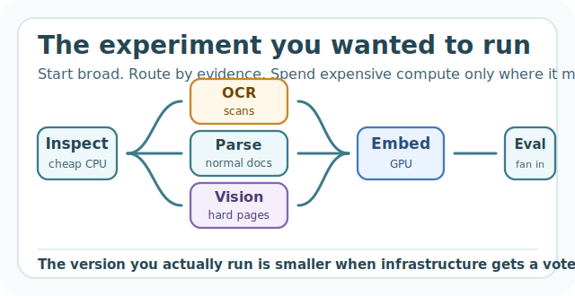
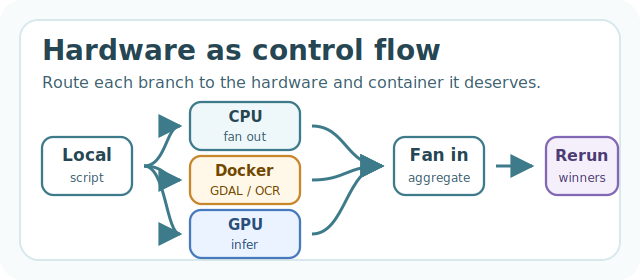

# The Experiment You Don't Run

<figure><figcaption></figcaption></figure>

Most ML and data work has a hidden planning step.

Before you ask the interesting question, you ask the infrastructure question.

How many CPUs do I need? Do I need a GPU? Can this fit in my notebook? Should I use Spark? Is this a batch job? Do I need a queue? Which Docker image has the right version of CUDA? Does the GDAL container also have PyTorch? How annoying will this be to rerun?

This sounds normal because we are used to it. But it is pretty strange.

Imagine if every time you wrote a Python function, you first had to decide which room in an office building the function would be allowed to run in. Some rooms have GPUs. Some rooms have lots of RAM. Some rooms have the right system libraries. Some rooms can see the data. Some rooms are cheap but might disappear. Some rooms are available only if you file the right ticket. You can use any room you want, in theory.

The cloud gave us an infinite office building.

But a lot of our tools still make us pick the room before we know what the work needs.

That is not just annoying. It changes the work.

## Infrastructure has veto power

Here is a very normal example.

Someone asks you to build search over a pile of company documents. PDFs, contracts, invoices, old support exports, customer-uploaded files, maybe a few scans from 2017 that nobody wants to think about.

The clean version sounds simple:

1. Parse documents.
2. Chunk text.
3. Embed chunks.
4. Build an index.
5. Run evals.

The real version reveals itself about 15 minutes in.

Some PDFs parse cleanly. Some are scanned and need OCR. Some have tables that matter. Some are 900 pages. Some are corrupt. Some are in the wrong language. Some chunks are obviously garbage. Some documents need a vision model. Some should be skipped. Some should be reprocessed with a slower parser only if a cheap pass says they matter.

So the actual program you want is not a straight line. It is a decision tree.

Start with cheap CPUs and inspect everything. Route normal PDFs through the fast parser. Send scans to OCR. Send table-heavy documents to a different container. Fan chunks out to GPUs for embeddings. Run a broad eval grid. Rerun low-confidence cases. Fan back in to build the index. Maybe run an expensive reranker only on the top candidates.

That is the obvious version of the work.

But it is often not the version people run.

Instead they sample 500 documents. Skip OCR for now. Use one embedding model. Hand-pick 20 eval questions. Promise to come back later. The prototype works, sort of, because the prototype has been shaped around what was easy to run.

This is the cost of infrastructure friction: it gives your curiosity a budget before the experiment starts.

## Static hardware makes static questions

A lot of systems still treat hardware as something you choose up front.

Pick a notebook instance. Pick a cluster. Pick a worker pool. Pick a Docker image. Pick a DAG. Pick CPU or GPU. Pick memory. Pick the queue.

Then write the code.

This works when the computation is already understood. But ML and data work often discovers its own shape while running. You do not know which files are weird until you inspect them. You do not know which hyperparameters deserve real training until the cheap sweep finishes. You do not know which rows need expensive validation until the first pass finds anomalies. You do not know whether the eval needs a reranker until retrieval fails in a specific way.

The natural pattern is escalation.

Start cheap and wide. Keep the interesting parts. Spend expensive hardware only where the data earns it.

This is how good scientists spend attention. But our infrastructure often asks for the spending plan before there is evidence.

So the question quietly shrinks.

Not "what is the real experiment?"

"What experiment fits in the room I already picked?"

## Hardware should be control flow

<figure><figcaption></figcaption></figure>

The abstraction I want is simple: hardware should be part of the program's control flow.

If a branch needs OCR, it should run in an OCR container. If the next branch needs CUDA, it should run on GPUs. If the next step is a million independent files, it should fan out across a thousand machines for a few minutes. If the next step is aggregation, it should fan back in.

Not as a platform migration. Not as a week of queue wiring. Not as a YAML ceremony.

As code.

Something spiritually like:

```python
profiles = map(inspect_file, files, cpu=2)

parsed = map(parse_pdf, normal_pdfs, image="python:3.12", cpu=4)

ocr_text = map(run_ocr, scanned_pdfs, image="ocr-stack", cpu=16)

embeddings = map(embed, chunks, image="pytorch-cuda", gpu="A100")

scores = map(evaluate, eval_grid, cpu=8)
```

The exact API is not the point. The point is where the decision lives.

The person writing the pipeline knows why one step needs GDAL, why another needs a GPU, why the weird files should be isolated, why the broad sweep should be cheap, and why only the winners deserve the expensive pass.

That logic belongs in the program.

Today it too often leaks into infrastructure.

## What becomes possible

The useful new thing is not "faster jobs." Faster jobs are nice. But speed is not the whole story.

The useful new thing is that you can write the ambitious version first.

For model search, the ambitious version is not one grid. It is a cascade.

Train 10,000 cheap models on small samples. Keep the best 1,000. Retrain those on more data. Keep the best 100. Add expensive features. Keep the best 10. Run calibration, explainability, robustness checks, and slice analysis.

Every stage wants different compute. Early stages want lots of cheap CPU parallelism. Later stages might want bigger memory machines or GPUs. Evaluation might want a different container. The static-cluster version makes this feel like a pipeline project. The dynamic version feels like a loop.

For data lake cleanup, the ambitious version is not one heroic parser. It is triage.

Fan out over every file. Classify schema, size, encoding, compression, corruption, and weirdness. Send normal files down the fast path. Send pathological files to heavier validation. Send huge files to high-memory machines. Keep examples of failures automatically. Produce a report that tells you what kind of mess you actually have.

For RAG evals, the ambitious version is not a 20-question spreadsheet. It is the full matrix.

Chunk sizes, embedding models, retrieval depths, rerankers, prompts, model versions, judging methods, datasets. Cheap filters first. Expensive judges later. You should be able to evaluate the actual space, not the tiny version that fits in your patience.

For geospatial work, the ambitious version is not one cursed Docker image with every dependency known to humanity. It is a program that changes environment as the work changes.

Tile satellite scenes in an `osgeo/gdal` container. Run segmentation on GPUs. Polygonize on CPUs. Aggregate by region. Rerun cloudy or low-confidence tiles with a slower path.

None of this is exotic. That is the point.

These are the obvious programs people would write if infrastructure did not keep interrupting.

## The adapter era

We have a lot of tools that make the cloud usable by adapting old workflows.

Docker makes environments portable. Queues make functions distributable. Spark makes dataframes run across clusters. Workflow engines make scripts schedulable. Hosted notebooks put the laptop in the cloud.

These are all useful. Some are great.

But they still make the user think in infrastructure nouns: clusters, workers, queues, images, DAGs, schedulers, node types.

That is fine if the job is infrastructure. It is not fine if the job is figuring out why the fraud model fails on a specific customer segment, or which documents need OCR, or whether a reranker actually improves retrieval, or which features are worth computing at all.

The next step is not hiding all infrastructure from everyone. Someone still needs to build it. The next step is moving the abstraction boundary high enough that more ML and data people can stay in the problem longer.

Functions. Inputs. Outputs. Hardware requirements. Containers where they matter. Real logs. Real exceptions. Fan out. Fan in.

That covers a shocking amount of work.

## Self-hosting is not a footnote

There is one more constraint that matters: the data often cannot move.

The best developer experience in the world is not very useful if the data plane has to leave your cloud account. Healthcare data, financial data, customer documents, internal logs, proprietary datasets, giant buckets already sitting in GCP. These are not edge cases. They are the work.

So the interesting future is not only "serverless compute."

It is serverless-feeling compute inside your own cloud.

The developer gets the magic: run the real experiment, fan out, switch hardware, switch containers, stream logs back.

The organization keeps the boring necessary stuff: IAM, buckets, auditability, data locality, cost control, network boundaries.

That combination matters because it makes the powerful thing acceptable.

## Why this still feels early

The cloud already won at the hardware layer. Nobody needs to be convinced that a thousand machines can exist.

The gap is that using them still feels too deliberate.

For ML and data work, the cloud often feels like a bigger version of the old machine model. Pick the machine. Enter the machine. Run the code. Hope you picked right.

But the shape of the work is dynamic. The compute should be dynamic too.

A script should start on your laptop, inspect the data, fan out, route weird cases, grab GPUs, switch containers, fan in, escalate promising branches, and shut everything down when it is done.

That is not just a faster way to run the same workflows.

It changes which workflows are worth attempting.

The next big improvement in cloud compute will not be that machines get bigger. They already got big.

It will be that infrastructure loses its veto over curiosity.

## Addendum

This is the direction we are working on with Burla.

Burla has one main function:

```python
from burla import remote_parallel_map

results = remote_parallel_map(my_function, inputs)
```

The goal is to make cloud hardware feel like something ordinary Python can use. Your function runs across remote machines. Prints come back locally. Exceptions come back locally. You can use different CPUs, GPUs, and Docker containers for different function calls. You can fan out over thousands of inputs, fan back in, and then run the next step on different hardware.

A pipeline can look like this:

```python
parsed = remote_parallel_map(
    parse_file,
    files,
    image="python:3.12",
    func_cpu=4,
)

embeddings = remote_parallel_map(
    embed,
    parsed,
    image="pytorch/pytorch:2.5.1-cuda12.4-cudnn9-runtime",
    func_gpu="A100",
)

index_parts = remote_parallel_map(
    build_index,
    embeddings,
    func_cpu=32,
)
```

Burla can be managed, but the self-hosted version is the part I care about most: install it into your own GCP project, keep data and compute in your cloud, and still get the local-feeling workflow.

We have examples like [processing 2.4TB of Parquet files on 10,000 CPUs in 76 seconds](examples/process-2.4tb-of-parquet-files-in-76s.md) and [hyperparameter tuning across 80-CPU machines](examples/parallel-hyperparameter-tuning.md). Those are fun demos.

But the benchmark is not the point.

The point is that when hardware becomes easy to change from inside the program, ML and data people can stop negotiating with infrastructure before they ask the real question.
